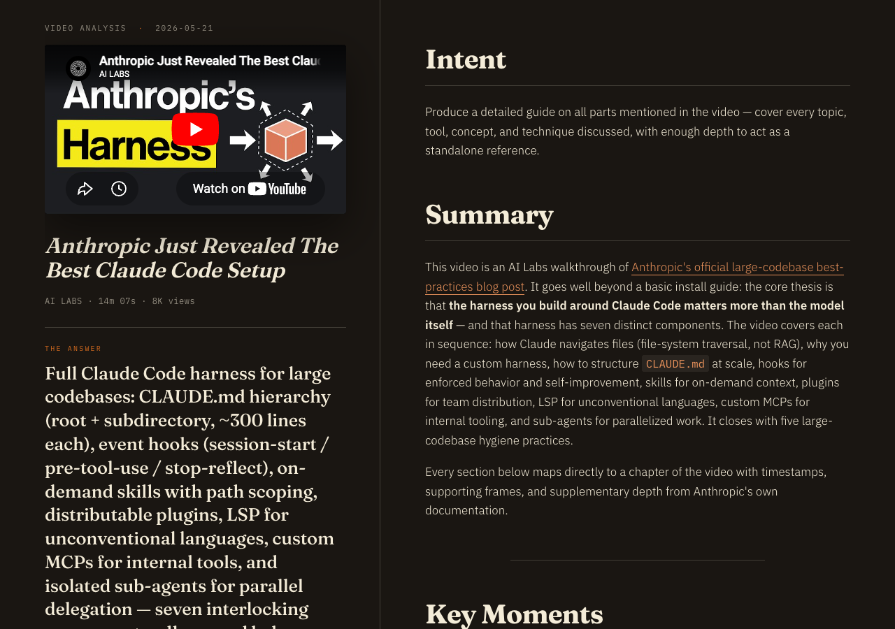
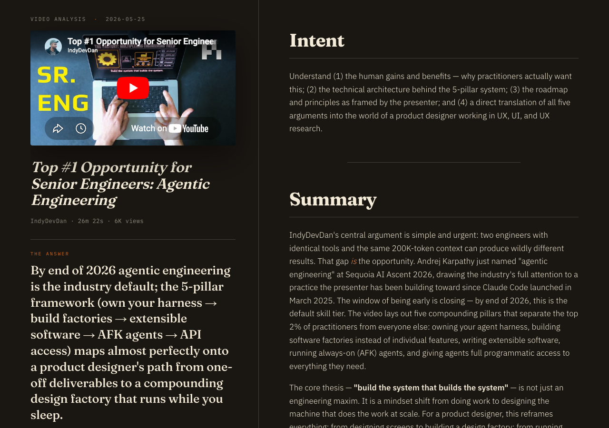
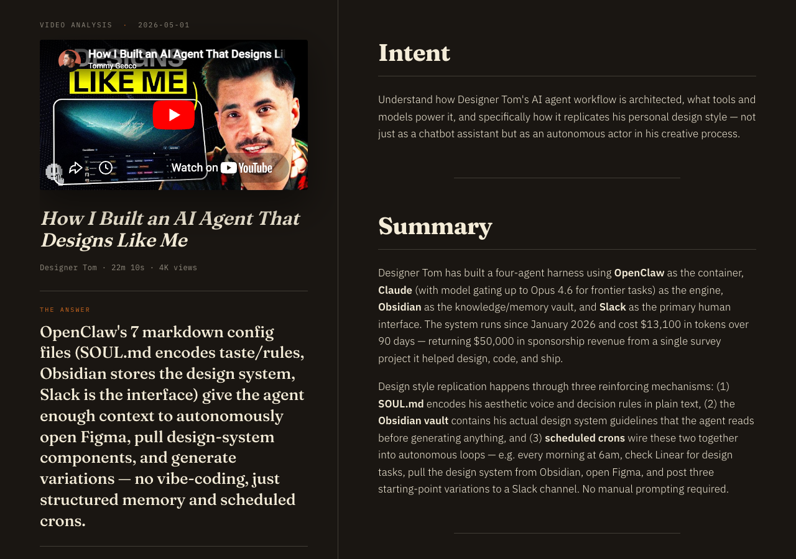

# ask-youtube

**Stop watching YouTube. Start interrogating it.**

You paste a YouTube URL. A swarm of Claude Code agents watches the whole
thing for you — reads the transcript, *looks* at the frames, fact-checks
against the web — and hands you back a magazine-grade analysis page that
answers the one question you actually had.

No 47-minute "in this video we'll cover" preamble. No scrubbing the
timeline for the diagram at 12:30. Just the answer, with the receipts.

---

## 👀 First, look at what it makes

Because telling you is boring. This is the *actual output* — one HTML page
per video, generated end-to-end from a single command:

### "What's Anthropic's actual recommended Claude Code setup?"


### "What's the real opportunity in agentic engineering — and what do I do about it?"


### "How did this guy build an AI agent that designs like him?"


Each page opens with **THE ANSWER** — the single most important sentence,
written to your exact question — then backs it with intent-scored key
frames, timestamped chapters, and supporting depth pulled from the web.

> 📄 Want to read full ones? The complete markdown for all three lives in
> [`examples/`](examples/). And here's a
> [full-length rendered page](docs/examples/example-1-anthropic-harness-full.png)
> so you can see how deep it goes.

---

## 🤔 What it actually does

Three speeds, depending on how much you care:

| Mode | Time | What you get | Cost |
|---|---|---|---|
| **`fast`** | ~30s | Transcript + key frames. Just the artefacts. | free |
| **`standard`** | ~1 min | Above + frame↔transcript correlation. | free |
| **`deep`** | ~10 min | The whole magic show: agents *describe every frame*, fact-check against the web, and synthesize the editorial HTML page you saw above. | ~$0.50–$2 in Claude tokens |

Under the hood:

- **`yt-dlp`** grabs the video, audio, transcript, and top comments.
- **`ffmpeg`** pulls key frames (scene-detected, then perceptually de-duped).
- In **deep** mode, a cheap Haiku pass scores every transcript line on
  *(is it visual?) × (does it match what you asked?)* and picks the ~20–40
  frames worth looking at — so a vision model doesn't burn money describing
  the intro bumper.
- Two **Claude Code sub-agents** finish the job: one *describes* the chosen
  frames, one *synthesizes* everything into the final answer.

---

## 📦 What you need

This is a Claude Code-native tool. If you've got Claude Code, you're 90%
there.

- **[Claude Code](https://claude.com/claude-code)** — installed and signed in
  (`claude` on your PATH). This is the engine for deep mode.
- **Python 3.10+**
- **[ffmpeg](https://ffmpeg.org/)** — `brew install ffmpeg` (macOS) /
  `apt install ffmpeg` (Linux)
- A browser signed into YouTube (Chrome by default) — YouTube increasingly
  demands cookies to download. See [Cookies](#-cookies) below.

`fast` and `standard` modes don't need Claude Code at all — just Python +
ffmpeg.

---

## 🚀 Install

```bash
git clone https://github.com/lukaspitter/ask-youtube.git
cd ask-youtube

python3 -m venv .venv
.venv/bin/pip install -r requirements.txt
```

That's it. `yt-dlp` ships in `requirements.txt`, so you don't need a
system-wide install.

---

## 🎬 Usage

Run everything **from the repo root** — deep mode looks for its agents in
`./.claude/agents/`, so the working directory matters.

**Just grab the transcript + frames (fast):**
```bash
.venv/bin/python3 scripts/fetch.py "https://youtu.be/VIDEO_ID" --mode standard
```

**The good stuff — a full analysis answering your question (deep):**
```bash
.venv/bin/python3 scripts/fetch.py "https://youtu.be/VIDEO_ID" \
  --mode deep \
  --intent "How does the auth flow actually work?"
```

`--intent` is the whole game in deep mode. It's what the frame-picker scores
against and what THE ANSWER is written to. Be specific:

- 🚫 `--intent "summarize this"`
- ✅ `--intent "What are the exact CLAUDE.md patterns they recommend, and why?"`

**Re-ask a different question on a video you already pulled** (skips the
download entirely):
```bash
.venv/bin/python3 scripts/analyze_video.py "output/260101-ytb-some-video/" \
  --intent "A totally different angle"
```

**Other handy flags:**

| Flag | Does |
|---|---|
| `--frames N` | Cap how many frames get analysed. `--frames 0` = transcript only (fast/standard). |
| `--skip-video` | Don't download the video file — transcript + frames only. |
| `-m fast` | Skip correlation, just dump artefacts. |

### Doing it the lazy way (from inside Claude Code)

Since the agents already live in `.claude/agents/`, you can also just open
this repo in Claude Code and say:

> "deep-analyze https://youtu.be/VIDEO_ID — I want to know X"

…and let Claude drive `fetch.py` for you. Whatever's comfier.

---

## 🗂 What lands on disk

Each run drops a self-contained folder under `output/`:

```
output/YYMMDD-ytb-<slug>/
├── video.mp4               # the video (skip with --skip-video)
├── audio.mp3               # extracted audio
├── metadata.json           # title, channel, views, duration
├── transcript.srt          # cleaned transcript
├── comments.json           # top comments
├── frames/                 # extracted key frames
├── frames_selection.json   # deep+intent: why each frame was picked
├── analysis.md             # deep: the answer, in markdown
└── analysis.html           # deep: the shareable rendered page ⭐
```

`analysis.html` is a single, self-styled page (the editorial look you saw
up top). Open it locally, drop it on any static host, done.

---

## ⚙️ Config

Everything's tunable via env vars — sensible defaults out of the box:

| Var | Default | What |
|---|---|---|
| `YTF_OUTPUT_DIR` | `./output` | Where runs get written |
| `YTF_BROWSER` | `chrome` | Browser to pull YouTube cookies from |
| `YTF_MAX_FRAMES_DEEP_INTENT` | `40` | Cap on intent-scored frames in deep mode |
| `YTF_MAX_COMMENTS` | `20` | How many comments to keep |
| `ASK_YT_PUBLIC_URL` | *(unset)* | Base URL if you serve pages behind a token gate |

---

## 🍪 Cookies

YouTube now wants cookies to download most videos. By default the tool reads
them from Chrome (`--cookies-from-browser chrome`). If your YouTube login
lives in another browser:

```bash
YTF_BROWSER=firefox .venv/bin/python3 scripts/fetch.py "URL" --mode standard
```

If downloads fail with "No video formats found" or a sign-in wall, this is
almost always the cause.

---

## 🧪 Tests

```bash
.venv/bin/python3 -m pytest tests/ -q
```

---

## A few honest notes

- **Deep mode is slow on purpose.** It's describing every chosen frame with
  a vision model and fact-checking against the web. ~10 minutes is normal.
  Don't kill it because it looks hung.
- **It costs a little money.** Deep runs spend Claude tokens — budget
  ~$0.50–$2 per video. `fast`/`standard` are free.
- **The frame-picker follows your intent.** If it missed a moment you cared
  about, sharpen `--intent` before reaching for `--frames`. Check
  `frames_selection.json` to see what it scored and why.
- **Share tokens are auth.** Deep mode mints a `.share_token`. Anyone with a
  URL containing it can read the page. It's `.gitignore`d for a reason —
  don't commit it.

---

## License

MIT — see [LICENSE](LICENSE). Built on [Claude Code](https://claude.com/claude-code),
[yt-dlp](https://github.com/yt-dlp/yt-dlp), and [ffmpeg](https://ffmpeg.org/).
